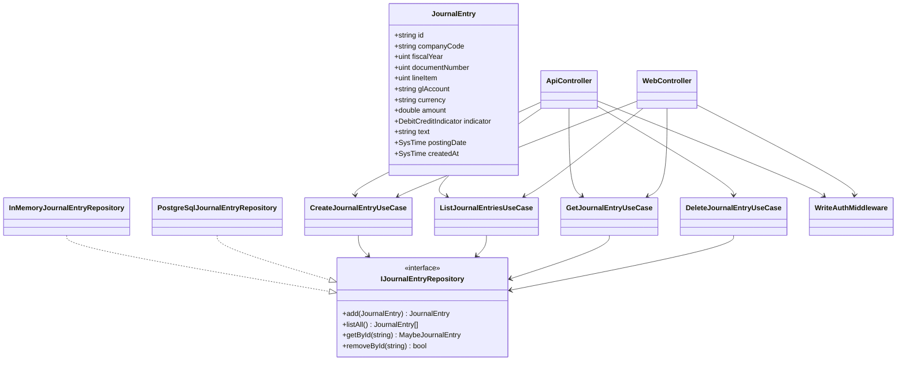
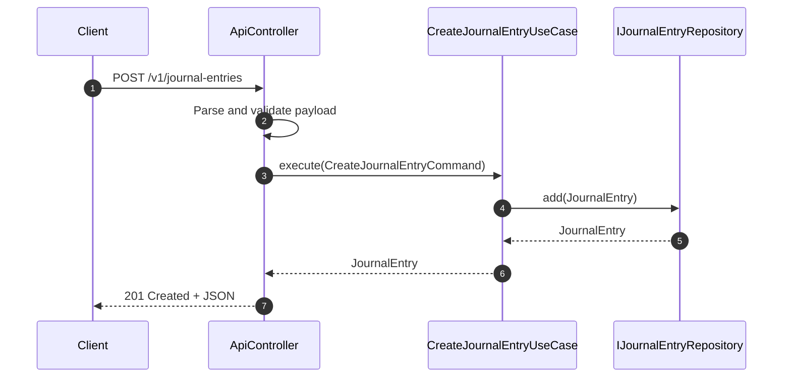
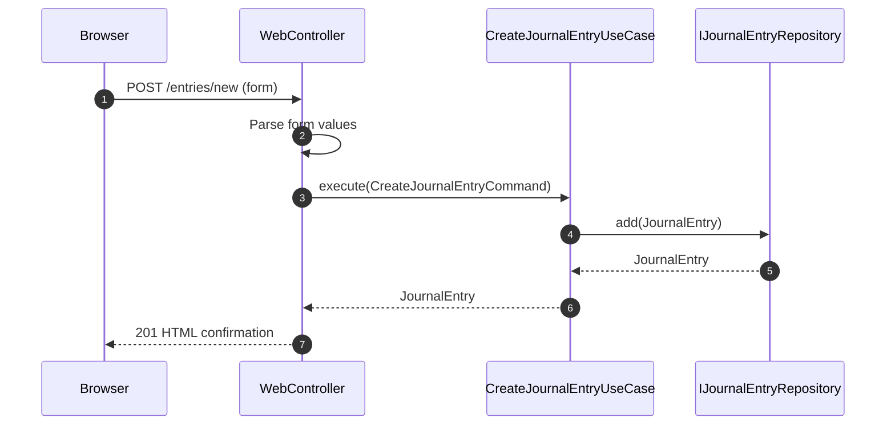

# UML - uim-acdoca-service

## Class diagram

```mermaid
classDiagram
    class JournalEntry {
      +string id
      +string companyCode
      +uint fiscalYear
      +uint documentNumber
      +uint lineItem
      +string glAccount
      +string currency
      +double amount
      +DebitCreditIndicator indicator
      +string text
      +SysTime postingDate
      +SysTime createdAt
    }

    class IJournalEntryRepository {
      <<interface>>
      +add(JournalEntry) JournalEntry
      +listAll() JournalEntry[]
      +getById(string) MaybeJournalEntry
      +removeById(string) bool
    }

    class InMemoryJournalEntryRepository
    class PostgreSqlJournalEntryRepository
    class CreateJournalEntryUseCase
    class ListJournalEntriesUseCase
    class GetJournalEntryUseCase
    class DeleteJournalEntryUseCase
    class WriteAuthMiddleware
    class ApiController
    class WebController

    InMemoryJournalEntryRepository ..|> IJournalEntryRepository
    PostgreSqlJournalEntryRepository ..|> IJournalEntryRepository
    CreateJournalEntryUseCase --> IJournalEntryRepository
    ListJournalEntriesUseCase --> IJournalEntryRepository
    GetJournalEntryUseCase --> IJournalEntryRepository
    DeleteJournalEntryUseCase --> IJournalEntryRepository

    ApiController --> CreateJournalEntryUseCase
    ApiController --> ListJournalEntriesUseCase
    ApiController --> GetJournalEntryUseCase
    ApiController --> DeleteJournalEntryUseCase
    ApiController --> WriteAuthMiddleware

    WebController --> CreateJournalEntryUseCase
    WebController --> ListJournalEntriesUseCase
    WebController --> GetJournalEntryUseCase
    WebController --> WriteAuthMiddleware
```

## Sequence diagram - JSON API post

```mermaid
sequenceDiagram
    autonumber
    participant Client
    participant API as ApiController
    participant UC as CreateJournalEntryUseCase
    participant Repo as IJournalEntryRepository

    Client->>API: POST /v1/journal-entries
    API->>API: Parse and validate payload
    API->>UC: execute(CreateJournalEntryCommand)
    UC->>Repo: add(JournalEntry)
    Repo-->>UC: JournalEntry
    UC-->>API: JournalEntry
    API-->>Client: 201 Created + JSON
```

## Sequence diagram - MVC post

```mermaid
sequenceDiagram
    autonumber
    participant Browser
    participant WEB as WebController
    participant UC as CreateJournalEntryUseCase
    participant Repo as IJournalEntryRepository

    Browser->>WEB: POST /entries/new (form)
    WEB->>WEB: Parse form values
    WEB->>UC: execute(CreateJournalEntryCommand)
    UC->>Repo: add(JournalEntry)
    Repo-->>UC: JournalEntry
    UC-->>WEB: JournalEntry
    WEB-->>Browser: 201 HTML confirmation
```
