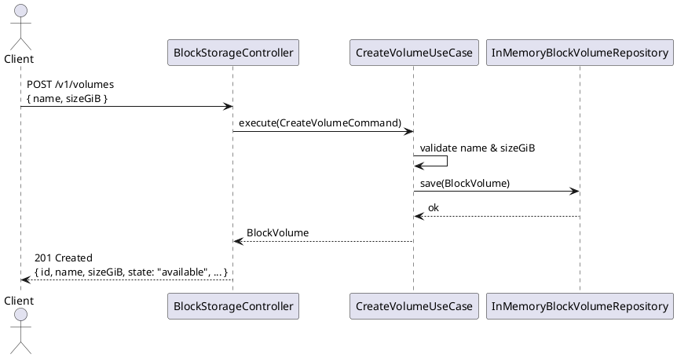
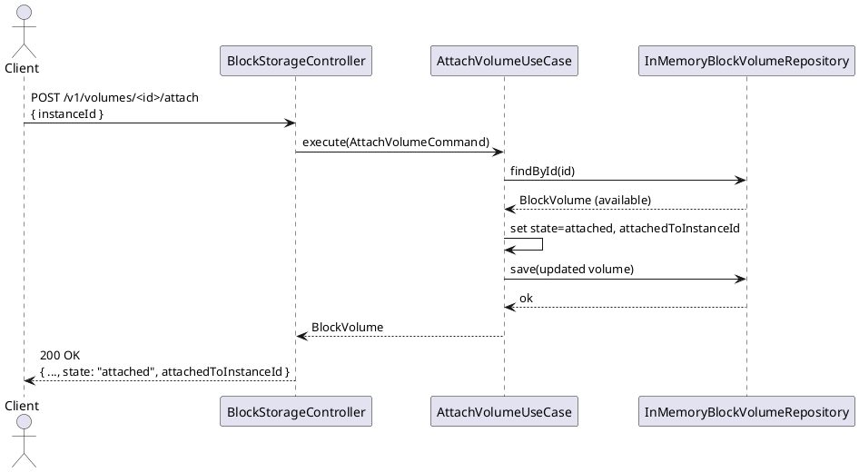
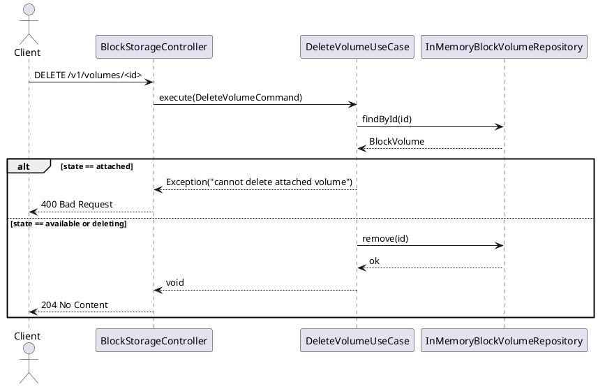
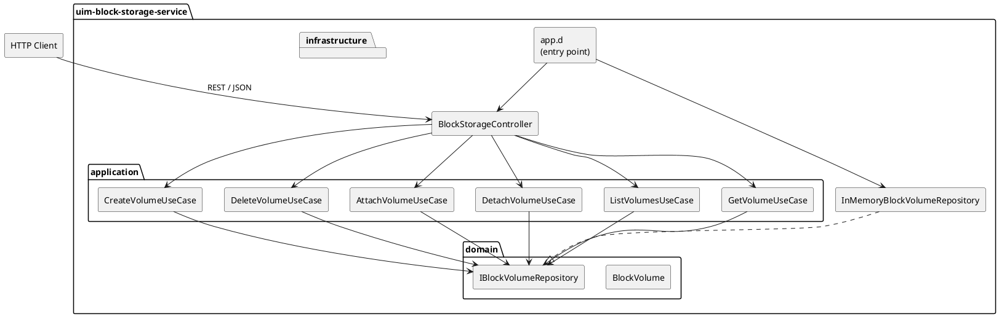
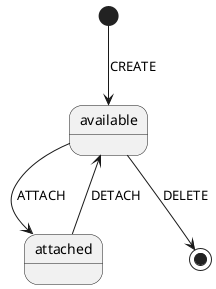

# UML Diagrams – uim-block-storage-service

## 1. Class Diagram

```plantuml
@startuml block-storage-class-diagram
skinparam classAttributeIconSize 0
skinparam packageStyle rectangle

package "domain" {
  enum VolumeState {
    available
    attached
    deleting
  }

  class BlockVolume {
    + id : string
    + name : string
    + sizeGiB : ulong
    + state : VolumeState
    + attachedToInstanceId : string
    + createdAt : SysTime
  }

  interface IBlockVolumeRepository {
    + save(volume : BlockVolume) : void
    + remove(id : string) : void
    + list() : BlockVolume[]
    + findById(id : string) : BlockVolume*
  }

  BlockVolume ..> VolumeState
}

package "application.dto" {
  class CreateVolumeCommand {
    + name : string
    + sizeGiB : ulong
  }
  class DeleteVolumeCommand {
    + id : string
  }
  class AttachVolumeCommand {
    + id : string
    + instanceId : string
  }
  class DetachVolumeCommand {
    + id : string
  }
  class GetVolumeQuery {
    + id : string
  }
}

package "application.usecases" {
  class CreateVolumeUseCase {
    - repository : IBlockVolumeRepository
    + execute(cmd : CreateVolumeCommand) : BlockVolume
  }
  class DeleteVolumeUseCase {
    - repository : IBlockVolumeRepository
    + execute(cmd : DeleteVolumeCommand) : void
  }
  class AttachVolumeUseCase {
    - repository : IBlockVolumeRepository
    + execute(cmd : AttachVolumeCommand) : BlockVolume
  }
  class DetachVolumeUseCase {
    - repository : IBlockVolumeRepository
    + execute(cmd : DetachVolumeCommand) : BlockVolume
  }
  class ListVolumesUseCase {
    - repository : IBlockVolumeRepository
    + execute() : BlockVolume[]
  }
  class GetVolumeUseCase {
    - repository : IBlockVolumeRepository
    + execute(q : GetVolumeQuery) : BlockVolume*
  }

  CreateVolumeUseCase --> IBlockVolumeRepository
  DeleteVolumeUseCase --> IBlockVolumeRepository
  AttachVolumeUseCase --> IBlockVolumeRepository
  DetachVolumeUseCase --> IBlockVolumeRepository
  ListVolumesUseCase  --> IBlockVolumeRepository
  GetVolumeUseCase    --> IBlockVolumeRepository

  CreateVolumeUseCase ..> CreateVolumeCommand
  DeleteVolumeUseCase ..> DeleteVolumeCommand
  AttachVolumeUseCase ..> AttachVolumeCommand
  DetachVolumeUseCase ..> DetachVolumeCommand
  GetVolumeUseCase    ..> GetVolumeQuery
}

package "infrastructure.persistence.memory" {
  class InMemoryBlockVolumeRepository {
    - volumes : BlockVolume[]
    - mutex : Mutex
    + save(volume : BlockVolume) : void
    + remove(id : string) : void
    + list() : BlockVolume[]
    + findById(id : string) : BlockVolume*
  }
  InMemoryBlockVolumeRepository ..|> IBlockVolumeRepository
}

package "infrastructure.http.controllers" {
  class BlockVolumeView {
    + id : string
    + name : string
    + sizeGiB : ulong
    + state : string
    + attachedToInstanceId : string
    + createdAt : string
  }

  class BlockStorageController {
    - createUseCase : CreateVolumeUseCase
    - deleteUseCase : DeleteVolumeUseCase
    - attachUseCase : AttachVolumeUseCase
    - detachUseCase : DetachVolumeUseCase
    - listUseCase : ListVolumesUseCase
    - getUseCase : GetVolumeUseCase
    + registerRoutes(router : URLRouter) : void
    + health(req, res) : void
    + listVolumes(req, res) : void
    + createVolume(req, res) : void
    + getVolume(req, res) : void
    + deleteVolume(req, res) : void
    + attachVolume(req, res) : void
    + detachVolume(req, res) : void
  }

  BlockStorageController --> CreateVolumeUseCase
  BlockStorageController --> DeleteVolumeUseCase
  BlockStorageController --> AttachVolumeUseCase
  BlockStorageController --> DetachVolumeUseCase
  BlockStorageController --> ListVolumesUseCase
  BlockStorageController --> GetVolumeUseCase
  BlockStorageController ..> BlockVolumeView
}
@enduml
```

---

## 2. Sequence Diagram – Create Volume

---

## 3. Sequence Diagram – Attach Volume

---

## 4. Sequence Diagram – Delete Volume

---

## 5. Component Diagram

---

## 6. State Diagram – Volume Lifecycle

