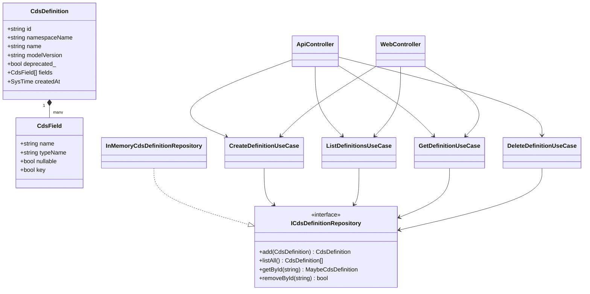
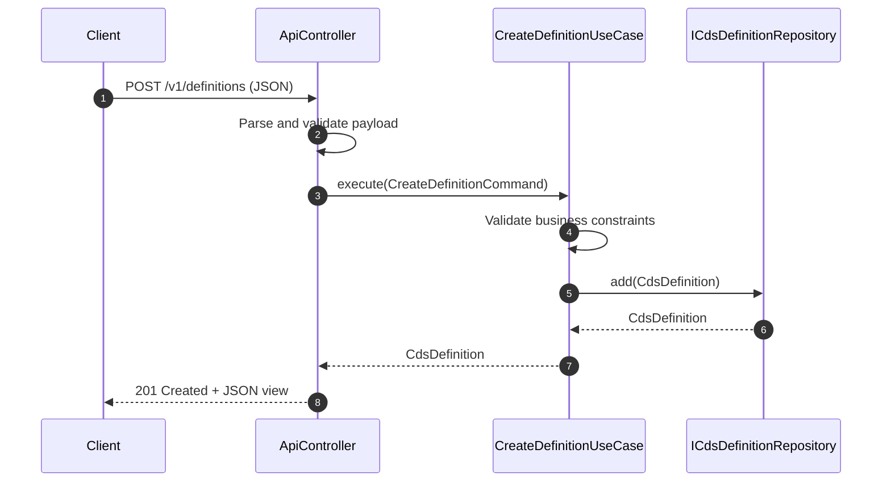
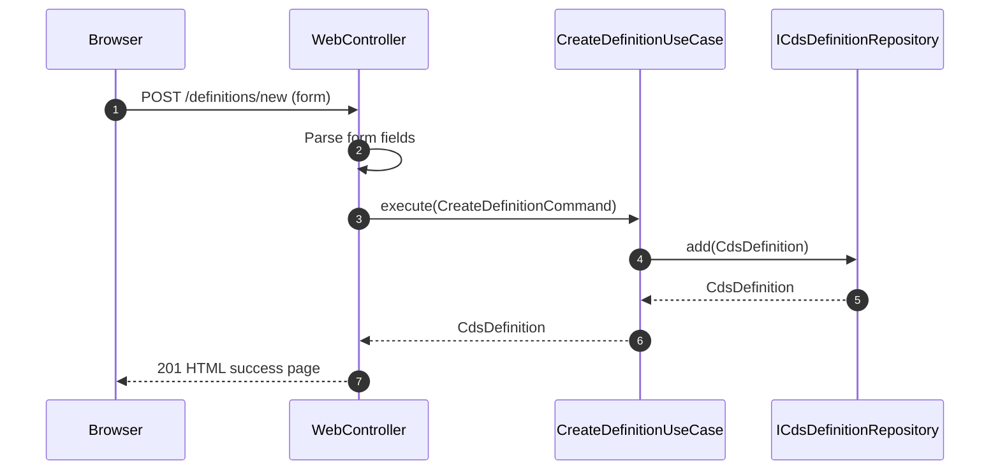

# UML - uim-cds-service

## Class diagram

```mermaid
classDiagram
    class CdsDefinition {
      +string id
      +string namespaceName
      +string name
      +string modelVersion
      +bool deprecated_
      +CdsField[] fields
      +SysTime createdAt
    }

    class CdsField {
      +string name
      +string typeName
      +bool nullable
      +bool key
    }

    class ICdsDefinitionRepository {
      <<interface>>
      +add(CdsDefinition) CdsDefinition
      +listAll() CdsDefinition[]
      +getById(string) MaybeCdsDefinition
      +removeById(string) bool
    }

    class InMemoryCdsDefinitionRepository
    class CreateDefinitionUseCase
    class ListDefinitionsUseCase
    class GetDefinitionUseCase
    class DeleteDefinitionUseCase
    class ApiController
    class WebController

    CdsDefinition "1" *-- "many" CdsField
    InMemoryCdsDefinitionRepository ..|> ICdsDefinitionRepository

    CreateDefinitionUseCase --> ICdsDefinitionRepository
    ListDefinitionsUseCase --> ICdsDefinitionRepository
    GetDefinitionUseCase --> ICdsDefinitionRepository
    DeleteDefinitionUseCase --> ICdsDefinitionRepository

    ApiController --> CreateDefinitionUseCase
    ApiController --> ListDefinitionsUseCase
    ApiController --> GetDefinitionUseCase
    ApiController --> DeleteDefinitionUseCase

    WebController --> CreateDefinitionUseCase
    WebController --> ListDefinitionsUseCase
    WebController --> GetDefinitionUseCase
```

## Sequence diagram - API create definition

```mermaid
sequenceDiagram
    autonumber
    participant Client
    participant API as ApiController
    participant UC as CreateDefinitionUseCase
    participant Repo as ICdsDefinitionRepository

    Client->>API: POST /v1/definitions (JSON)
    API->>API: Parse and validate payload
    API->>UC: execute(CreateDefinitionCommand)
    UC->>UC: Validate business constraints
    UC->>Repo: add(CdsDefinition)
    Repo-->>UC: CdsDefinition
    UC-->>API: CdsDefinition
    API-->>Client: 201 Created + JSON view
```

## Sequence diagram - MVC create definition

```mermaid
sequenceDiagram
    autonumber
    participant Browser
    participant WEB as WebController
    participant UC as CreateDefinitionUseCase
    participant Repo as ICdsDefinitionRepository

    Browser->>WEB: POST /definitions/new (form)
    WEB->>WEB: Parse form fields
    WEB->>UC: execute(CreateDefinitionCommand)
    UC->>Repo: add(CdsDefinition)
    Repo-->>UC: CdsDefinition
    UC-->>WEB: CdsDefinition
    WEB-->>Browser: 201 HTML success page
```
