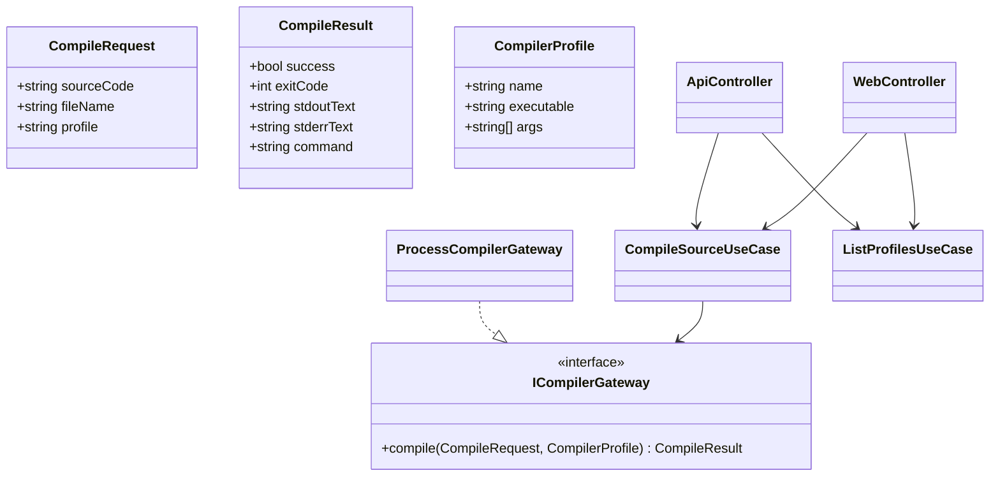
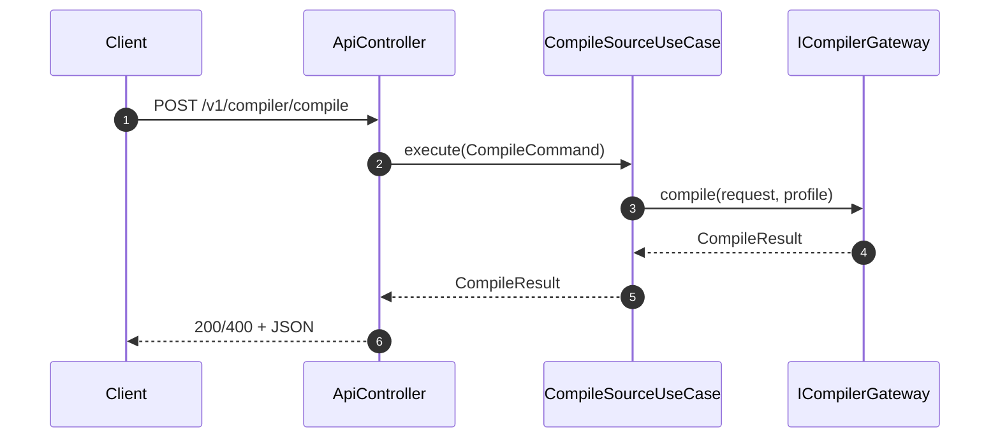
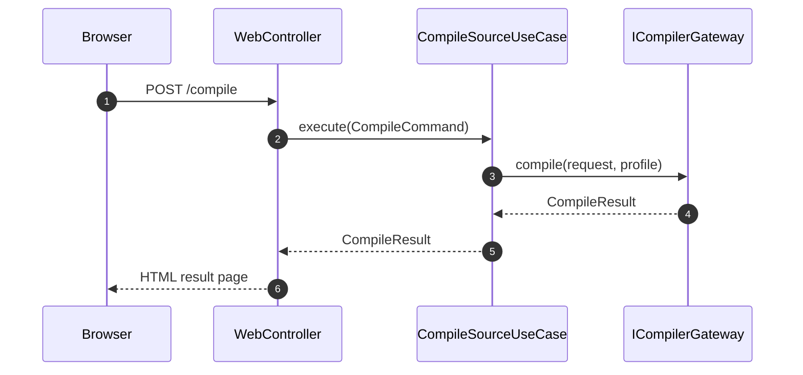

# UML - uim-dlang-compiler-service

## Class diagram

```mermaid
classDiagram
    class CompileRequest {
      +string sourceCode
      +string fileName
      +string profile
    }

    class CompileResult {
      +bool success
      +int exitCode
      +string stdoutText
      +string stderrText
      +string command
    }

    class CompilerProfile {
      +string name
      +string executable
      +string[] args
    }

    class ICompilerGateway {
      <<interface>>
      +compile(CompileRequest, CompilerProfile) CompileResult
    }

    class ProcessCompilerGateway
    class CompileSourceUseCase
    class ListProfilesUseCase
    class ApiController
    class WebController

    ProcessCompilerGateway ..|> ICompilerGateway
    CompileSourceUseCase --> ICompilerGateway
    ApiController --> CompileSourceUseCase
    ApiController --> ListProfilesUseCase
    WebController --> CompileSourceUseCase
    WebController --> ListProfilesUseCase
```

## Sequence diagram - JSON compile

```mermaid
sequenceDiagram
    autonumber
    participant Client
    participant API as ApiController
    participant UC as CompileSourceUseCase
    participant GW as ICompilerGateway

    Client->>API: POST /v1/compiler/compile
    API->>UC: execute(CompileCommand)
    UC->>GW: compile(request, profile)
    GW-->>UC: CompileResult
    UC-->>API: CompileResult
    API-->>Client: 200/400 + JSON
```

## Sequence diagram - MVC compile

```mermaid
sequenceDiagram
    autonumber
    participant Browser
    participant WEB as WebController
    participant UC as CompileSourceUseCase
    participant GW as ICompilerGateway

    Browser->>WEB: POST /compile
    WEB->>UC: execute(CompileCommand)
    UC->>GW: compile(request, profile)
    GW-->>UC: CompileResult
    UC-->>WEB: CompileResult
    WEB-->>Browser: HTML result page
```
