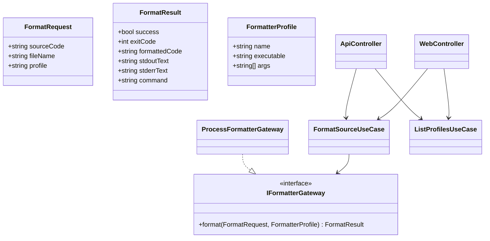
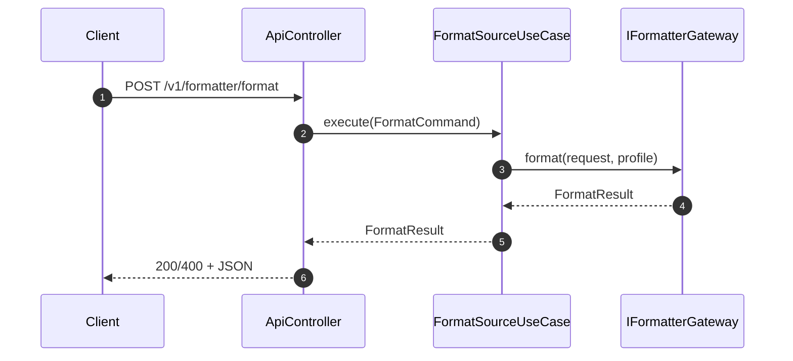
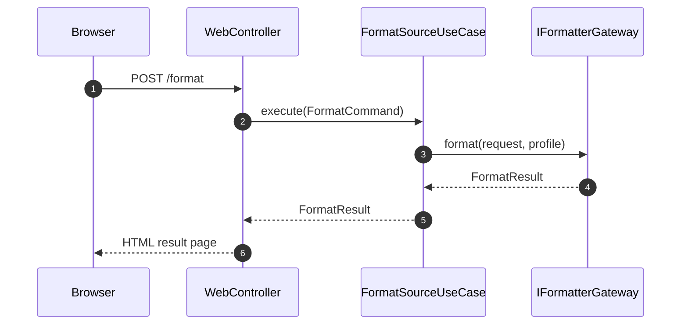

# UML - uim-dlang-formatter-service

## Class diagram

```mermaid
classDiagram
    class FormatRequest {
      +string sourceCode
      +string fileName
      +string profile
    }

    class FormatResult {
      +bool success
      +int exitCode
      +string formattedCode
      +string stdoutText
      +string stderrText
      +string command
    }

    class FormatterProfile {
      +string name
      +string executable
      +string[] args
    }

    class IFormatterGateway {
      <<interface>>
      +format(FormatRequest, FormatterProfile) FormatResult
    }

    class ProcessFormatterGateway
    class FormatSourceUseCase
    class ListProfilesUseCase
    class ApiController
    class WebController

    ProcessFormatterGateway ..|> IFormatterGateway
    FormatSourceUseCase --> IFormatterGateway
    ApiController --> FormatSourceUseCase
    ApiController --> ListProfilesUseCase
    WebController --> FormatSourceUseCase
    WebController --> ListProfilesUseCase
```

## Sequence diagram - JSON format

```mermaid
sequenceDiagram
    autonumber
    participant Client
    participant API as ApiController
    participant UC as FormatSourceUseCase
    participant GW as IFormatterGateway

    Client->>API: POST /v1/formatter/format
    API->>UC: execute(FormatCommand)
    UC->>GW: format(request, profile)
    GW-->>UC: FormatResult
    UC-->>API: FormatResult
    API-->>Client: 200/400 + JSON
```

## Sequence diagram - MVC format

```mermaid
sequenceDiagram
    autonumber
    participant Browser
    participant WEB as WebController
    participant UC as FormatSourceUseCase
    participant GW as IFormatterGateway

    Browser->>WEB: POST /format
    WEB->>UC: execute(FormatCommand)
    UC->>GW: format(request, profile)
    GW-->>UC: FormatResult
    UC-->>WEB: FormatResult
    WEB-->>Browser: HTML result page
```
