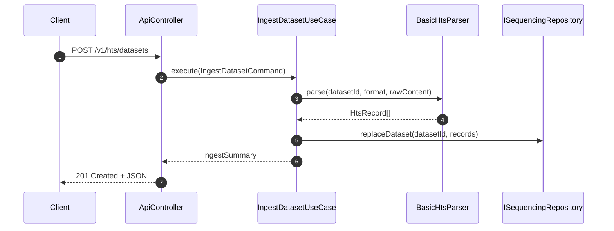
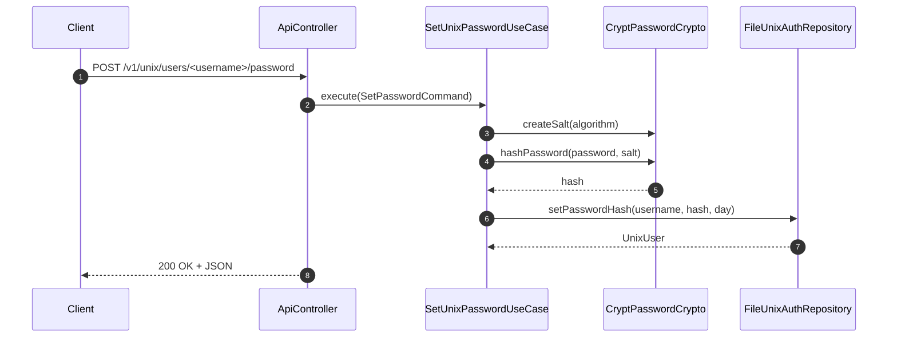

# UML - uim-hts-service

## Class diagram

```mermaid
classDiagram
    class HtsRecord {
      +string id
      +string datasetId
      +HtsFormat format
      +string referenceName
      +long position
      +string sampleName
      +string payload
    }

    class ISequencingRepository {
      <<interface>>
      +replaceDataset(string, HtsRecord[])
      +listByDataset(string) HtsRecord[]
      +listByReference(string, string) HtsRecord[]
      +listDatasets() string[]
    }

    class IHtsParser {
      <<interface>>
      +parse(string, HtsFormat, string) HtsRecord[]
    }

    class IUnixAuthRepository {
      <<interface>>
      +listUsers() UnixUser[]
      +getUser(string) MaybeUnixUser
      +createUser(PasswdEntry, ShadowEntry) UnixUser
      +setPasswordHash(string, string, long) UnixUser
    }

    class IPasswordCrypto {
      <<interface>>
      +createSalt(string, uint) string
      +hashPassword(string, string) string
      +verifyPassword(string, string) bool
    }

    class InMemorySequencingRepository
    class BasicHtsParser
    class FileUnixAuthRepository
    class CryptPasswordCrypto

    class IngestDatasetUseCase
    class ListDatasetRecordsUseCase
    class ListByReferenceUseCase
    class ListDatasetsUseCase

    class ListUnixUsersUseCase
    class GetUnixUserUseCase
    class CreateUnixUserUseCase
    class SetUnixPasswordUseCase
    class GenerateUnixHashUseCase
    class VerifyUnixPasswordUseCase

    class ApiController
    class WebController

    InMemorySequencingRepository ..|> ISequencingRepository
    BasicHtsParser ..|> IHtsParser
    FileUnixAuthRepository ..|> IUnixAuthRepository
    CryptPasswordCrypto ..|> IPasswordCrypto

    IngestDatasetUseCase --> ISequencingRepository
    IngestDatasetUseCase --> IHtsParser
    ListDatasetRecordsUseCase --> ISequencingRepository
    ListByReferenceUseCase --> ISequencingRepository
    ListDatasetsUseCase --> ISequencingRepository

    ListUnixUsersUseCase --> IUnixAuthRepository
    GetUnixUserUseCase --> IUnixAuthRepository
    CreateUnixUserUseCase --> IUnixAuthRepository
    CreateUnixUserUseCase --> IPasswordCrypto
    SetUnixPasswordUseCase --> IUnixAuthRepository
    SetUnixPasswordUseCase --> IPasswordCrypto
    GenerateUnixHashUseCase --> IPasswordCrypto
    VerifyUnixPasswordUseCase --> IPasswordCrypto

    ApiController --> IngestDatasetUseCase
    ApiController --> ListDatasetRecordsUseCase
    ApiController --> ListByReferenceUseCase
    ApiController --> ListDatasetsUseCase
    ApiController --> ListUnixUsersUseCase
    ApiController --> GetUnixUserUseCase
    ApiController --> CreateUnixUserUseCase
    ApiController --> SetUnixPasswordUseCase
    ApiController --> GenerateUnixHashUseCase
    ApiController --> VerifyUnixPasswordUseCase

    WebController --> IngestDatasetUseCase
    WebController --> ListDatasetRecordsUseCase
    WebController --> ListByReferenceUseCase
    WebController --> ListDatasetsUseCase
    WebController --> ListUnixUsersUseCase
    WebController --> GetUnixUserUseCase
    WebController --> CreateUnixUserUseCase
    WebController --> SetUnixPasswordUseCase
    WebController --> GenerateUnixHashUseCase
```

## Sequence diagram - ingest dataset

```mermaid
sequenceDiagram
    autonumber
    participant Client
    participant API as ApiController
    participant UC as IngestDatasetUseCase
    participant Parser as BasicHtsParser
    participant Repo as ISequencingRepository

    Client->>API: POST /v1/hts/datasets
    API->>UC: execute(IngestDatasetCommand)
    UC->>Parser: parse(datasetId, format, rawContent)
    Parser-->>UC: HtsRecord[]
    UC->>Repo: replaceDataset(datasetId, records)
    UC-->>API: IngestSummary
    API-->>Client: 201 Created + JSON
```

## Sequence diagram - UNIX password update

```mermaid
sequenceDiagram
    autonumber
    participant Client
    participant API as ApiController
    participant UC as SetUnixPasswordUseCase
    participant Crypto as CryptPasswordCrypto
    participant Repo as FileUnixAuthRepository

    Client->>API: POST /v1/unix/users/<username>/password
    API->>UC: execute(SetPasswordCommand)
    UC->>Crypto: createSalt(algorithm)
    UC->>Crypto: hashPassword(password, salt)
    Crypto-->>UC: hash
    UC->>Repo: setPasswordHash(username, hash, day)
    Repo-->>UC: UnixUser
    API-->>Client: 200 OK + JSON
```
