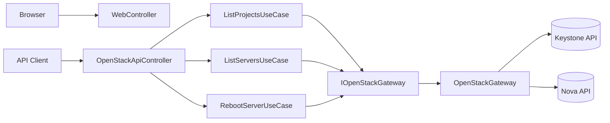
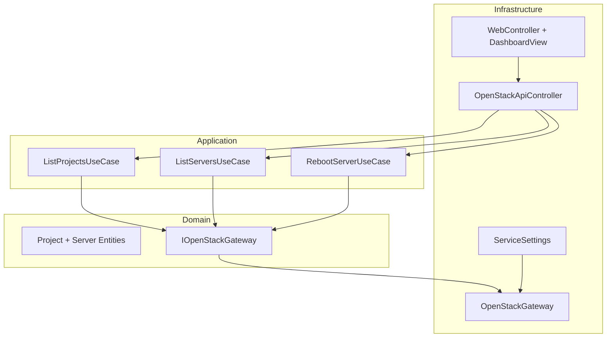
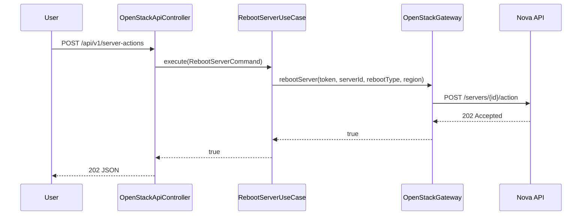

# UML - uim-openstack-service

## Component Diagram

```mermaid
flowchart LR
    Browser[Browser]
    Client[API Client]
    Web[WebController]
    Api[OpenStackApiController]
    UC1[ListProjectsUseCase]
    UC2[ListServersUseCase]
    UC3[RebootServerUseCase]
    Port[IOpenStackGateway]
    Adapter[OpenStackGateway]
    Keystone[(Keystone API)]
    Nova[(Nova API)]

    Browser --> Web
    Client --> Api
    Api --> UC1
    Api --> UC2
    Api --> UC3
    UC1 --> Port
    UC2 --> Port
    UC3 --> Port
    Port --> Adapter
    Adapter --> Keystone
    Adapter --> Nova
```

## Layered View

```mermaid
flowchart TB
    subgraph Domain
        Entities[Project + Server Entities]
        OutPort[IOpenStackGateway]
    end

    subgraph Application
        A1[ListProjectsUseCase]
        A2[ListServersUseCase]
        A3[RebootServerUseCase]
    end

    subgraph Infrastructure
        C1[OpenStackApiController]
        C2[WebController + DashboardView]
        G1[OpenStackGateway]
        CFG[ServiceSettings]
    end

    C1 --> A1
    C1 --> A2
    C1 --> A3
    C2 --> C1
    A1 --> OutPort
    A2 --> OutPort
    A3 --> OutPort
    OutPort --> G1
    CFG --> G1
```

## Sequence - Reboot Action

```mermaid
sequenceDiagram
    participant U as User
    participant API as OpenStackApiController
    participant UC as RebootServerUseCase
    participant GW as OpenStackGateway
    participant NOVA as Nova API

    U->>API: POST /api/v1/server-actions
    API->>UC: execute(RebootServerCommand)
    UC->>GW: rebootServer(token, serverId, rebootType, region)
    GW->>NOVA: POST /servers/{id}/action
    NOVA-->>GW: 202 Accepted
    GW-->>UC: true
    UC-->>API: true
    API-->>U: 202 JSON
```
