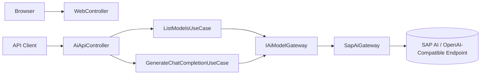
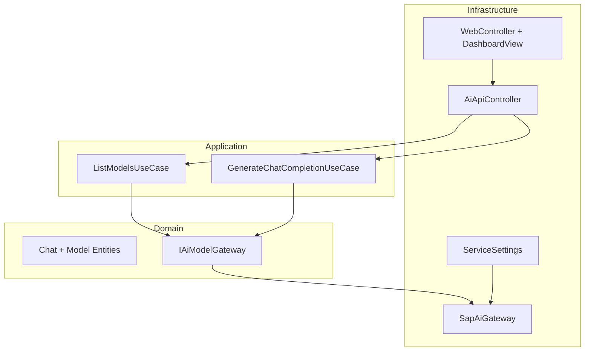
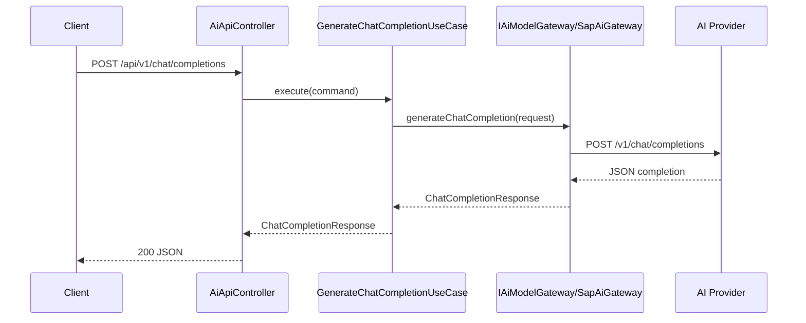

# UML - uim-sdk-ai-service

## Component Diagram

```mermaid
flowchart LR
    Browser[Browser]
    ApiClient[API Client]
    WebController[WebController]
    ApiController[AiApiController]
    ListModels[ListModelsUseCase]
    GenerateChat[GenerateChatCompletionUseCase]
    Port[IAiModelGateway]
    Adapter[SapAiGateway]
    Provider[(SAP AI / OpenAI-Compatible Endpoint)]

    Browser --> WebController
    ApiClient --> ApiController
    ApiController --> ListModels
    ApiController --> GenerateChat
    ListModels --> Port
    GenerateChat --> Port
    Port --> Adapter
    Adapter --> Provider
```

## Layered View

```mermaid
flowchart TB
    subgraph Domain
        Entities[Chat + Model Entities]
        Port2[IAiModelGateway]
    end

    subgraph Application
        UC1[ListModelsUseCase]
        UC2[GenerateChatCompletionUseCase]
    end

    subgraph Infrastructure
        API[AiApiController]
        WEB[WebController + DashboardView]
        GW[SapAiGateway]
        CFG[ServiceSettings]
    end

    API --> UC1
    API --> UC2
    WEB --> API
    UC1 --> Port2
    UC2 --> Port2
    Port2 --> GW
    CFG --> GW
```

## Sequence - Chat Completion

```mermaid
sequenceDiagram
    participant C as Client
    participant A as AiApiController
    participant U as GenerateChatCompletionUseCase
    participant G as IAiModelGateway/SapAiGateway
    participant P as AI Provider

    C->>A: POST /api/v1/chat/completions
    A->>U: execute(command)
    U->>G: generateChatCompletion(request)
    G->>P: POST /v1/chat/completions
    P-->>G: JSON completion
    G-->>U: ChatCompletionResponse
    U-->>A: ChatCompletionResponse
    A-->>C: 200 JSON
```
