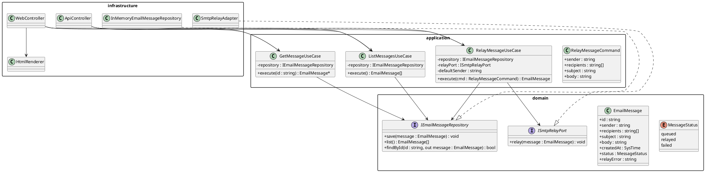
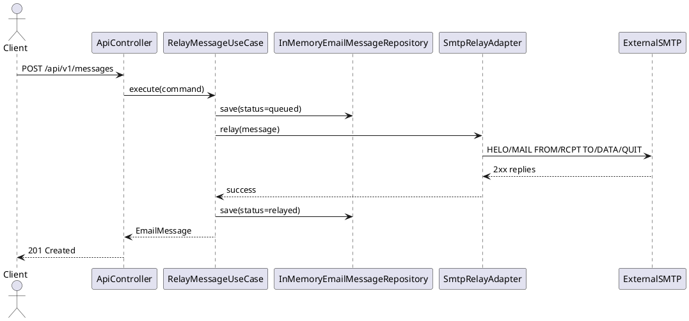
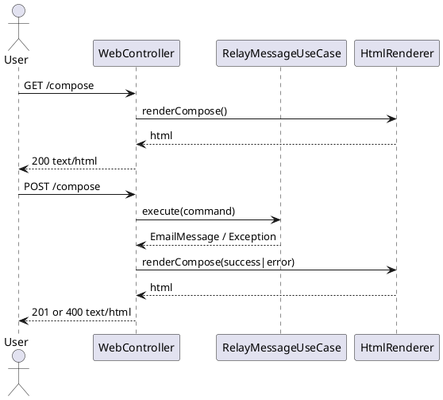

# UML - uim-smtp-relay-service

## Class Diagram

```plantuml
@startuml smtp-relay-class
skinparam classAttributeIconSize 0
skinparam packageStyle rectangle

package "domain" {
  enum MessageStatus {
    queued
    relayed
    failed
  }

  class EmailMessage {
    + id : string
    + sender : string
    + recipients : string[]
    + subject : string
    + body : string
    + createdAt : SysTime
    + status : MessageStatus
    + relayError : string
  }

  interface IEmailMessageRepository {
    + save(message : EmailMessage) : void
    + list() : EmailMessage[]
    + findById(id : string, out message : EmailMessage) : bool
  }

  interface ISmtpRelayPort {
    + relay(message : EmailMessage) : void
  }
}

package "application" {
  class RelayMessageCommand {
    + sender : string
    + recipients : string[]
    + subject : string
    + body : string
  }

  class RelayMessageUseCase {
    - repository : IEmailMessageRepository
    - relayPort : ISmtpRelayPort
    - defaultSender : string
    + execute(cmd : RelayMessageCommand) : EmailMessage
  }

  class ListMessagesUseCase {
    - repository : IEmailMessageRepository
    + execute() : EmailMessage[]
  }

  class GetMessageUseCase {
    - repository : IEmailMessageRepository
    + execute(id : string) : EmailMessage*
  }

  RelayMessageUseCase --> IEmailMessageRepository
  RelayMessageUseCase --> ISmtpRelayPort
  ListMessagesUseCase --> IEmailMessageRepository
  GetMessageUseCase --> IEmailMessageRepository
}

package "infrastructure" {
  class ApiController
  class WebController
  class HtmlRenderer
  class InMemoryEmailMessageRepository
  class SmtpRelayAdapter

  InMemoryEmailMessageRepository ..|> IEmailMessageRepository
  SmtpRelayAdapter ..|> ISmtpRelayPort

  ApiController --> RelayMessageUseCase
  ApiController --> ListMessagesUseCase
  ApiController --> GetMessageUseCase

  WebController --> RelayMessageUseCase
  WebController --> ListMessagesUseCase
  WebController --> GetMessageUseCase
  WebController --> HtmlRenderer
}
@enduml
```

## Sequence Diagram - API Relay Flow

```plantuml
@startuml smtp-relay-api-sequence
actor Client
participant ApiController
participant RelayMessageUseCase
participant InMemoryEmailMessageRepository as Repo
participant SmtpRelayAdapter as Smtp
participant ExternalSMTP

Client -> ApiController : POST /api/v1/messages
ApiController -> RelayMessageUseCase : execute(command)
RelayMessageUseCase -> Repo : save(status=queued)
RelayMessageUseCase -> Smtp : relay(message)
Smtp -> ExternalSMTP : HELO/MAIL FROM/RCPT TO/DATA/QUIT
ExternalSMTP --> Smtp : 2xx replies
Smtp --> RelayMessageUseCase : success
RelayMessageUseCase -> Repo : save(status=relayed)
RelayMessageUseCase --> ApiController : EmailMessage
ApiController --> Client : 201 Created
@enduml
```

## Sequence Diagram - MVC Compose Flow

```plantuml
@startuml smtp-relay-mvc-sequence
actor User
participant WebController
participant RelayMessageUseCase
participant HtmlRenderer

User -> WebController : GET /compose
WebController -> HtmlRenderer : renderCompose()
HtmlRenderer --> WebController : html
WebController --> User : 200 text/html

User -> WebController : POST /compose
WebController -> RelayMessageUseCase : execute(command)
RelayMessageUseCase --> WebController : EmailMessage / Exception
WebController -> HtmlRenderer : renderCompose(success|error)
HtmlRenderer --> WebController : html
WebController --> User : 201 or 400 text/html
@enduml
```
