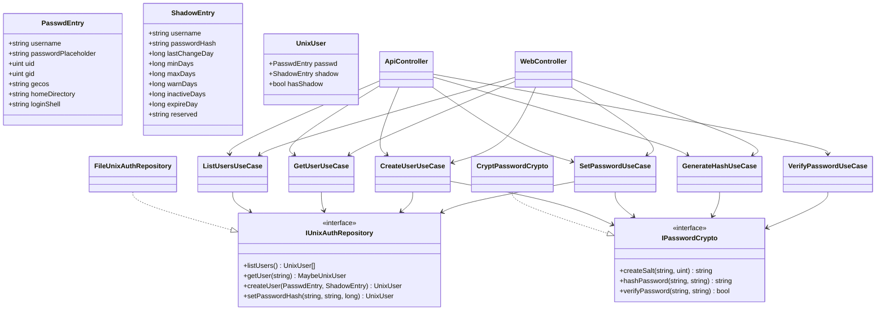
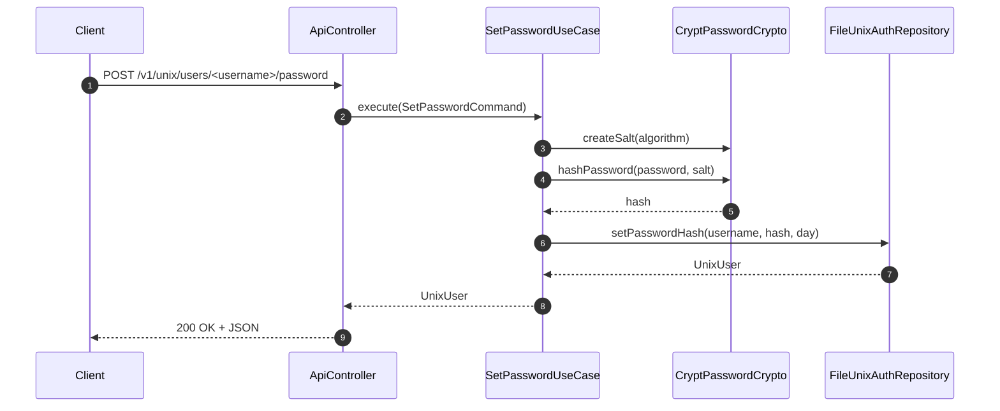
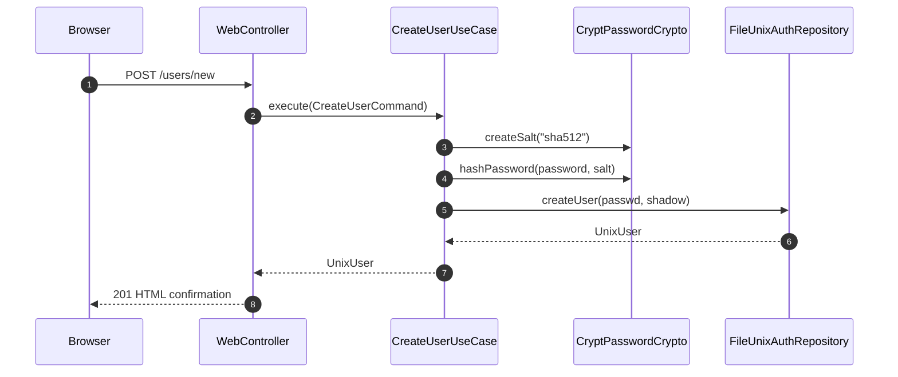

# UML - uim-unix-auth-service

## Class diagram

```mermaid
classDiagram
    class PasswdEntry {
      +string username
      +string passwordPlaceholder
      +uint uid
      +uint gid
      +string gecos
      +string homeDirectory
      +string loginShell
    }

    class ShadowEntry {
      +string username
      +string passwordHash
      +long lastChangeDay
      +long minDays
      +long maxDays
      +long warnDays
      +long inactiveDays
      +long expireDay
      +string reserved
    }

    class UnixUser {
      +PasswdEntry passwd
      +ShadowEntry shadow
      +bool hasShadow
    }

    class IUnixAuthRepository {
      <<interface>>
      +listUsers() UnixUser[]
      +getUser(string) MaybeUnixUser
      +createUser(PasswdEntry, ShadowEntry) UnixUser
      +setPasswordHash(string, string, long) UnixUser
    }

    class IPasswordCrypto {
      <<interface>>
      +createSalt(string, uint) string
      +hashPassword(string, string) string
      +verifyPassword(string, string) bool
    }

    class FileUnixAuthRepository
    class CryptPasswordCrypto
    class ListUsersUseCase
    class GetUserUseCase
    class CreateUserUseCase
    class SetPasswordUseCase
    class GenerateHashUseCase
    class VerifyPasswordUseCase
    class ApiController
    class WebController

    FileUnixAuthRepository ..|> IUnixAuthRepository
    CryptPasswordCrypto ..|> IPasswordCrypto

    ListUsersUseCase --> IUnixAuthRepository
    GetUserUseCase --> IUnixAuthRepository
    CreateUserUseCase --> IUnixAuthRepository
    CreateUserUseCase --> IPasswordCrypto
    SetPasswordUseCase --> IUnixAuthRepository
    SetPasswordUseCase --> IPasswordCrypto
    GenerateHashUseCase --> IPasswordCrypto
    VerifyPasswordUseCase --> IPasswordCrypto

    ApiController --> ListUsersUseCase
    ApiController --> GetUserUseCase
    ApiController --> CreateUserUseCase
    ApiController --> SetPasswordUseCase
    ApiController --> GenerateHashUseCase
    ApiController --> VerifyPasswordUseCase

    WebController --> ListUsersUseCase
    WebController --> GetUserUseCase
    WebController --> CreateUserUseCase
    WebController --> SetPasswordUseCase
    WebController --> GenerateHashUseCase
```

## Sequence diagram - set password (JSON)

```mermaid
sequenceDiagram
    autonumber
    participant Client
    participant API as ApiController
    participant UC as SetPasswordUseCase
    participant Crypto as CryptPasswordCrypto
    participant Repo as FileUnixAuthRepository

    Client->>API: POST /v1/unix/users/<username>/password
    API->>UC: execute(SetPasswordCommand)
    UC->>Crypto: createSalt(algorithm)
    UC->>Crypto: hashPassword(password, salt)
    Crypto-->>UC: hash
    UC->>Repo: setPasswordHash(username, hash, day)
    Repo-->>UC: UnixUser
    UC-->>API: UnixUser
    API-->>Client: 200 OK + JSON
```

## Sequence diagram - create user (MVC)

```mermaid
sequenceDiagram
    autonumber
    participant Browser
    participant WEB as WebController
    participant UC as CreateUserUseCase
    participant Crypto as CryptPasswordCrypto
    participant Repo as FileUnixAuthRepository

    Browser->>WEB: POST /users/new
    WEB->>UC: execute(CreateUserCommand)
    UC->>Crypto: createSalt("sha512")
    UC->>Crypto: hashPassword(password, salt)
    UC->>Repo: createUser(passwd, shadow)
    Repo-->>UC: UnixUser
    UC-->>WEB: UnixUser
    WEB-->>Browser: 201 HTML confirmation
```
